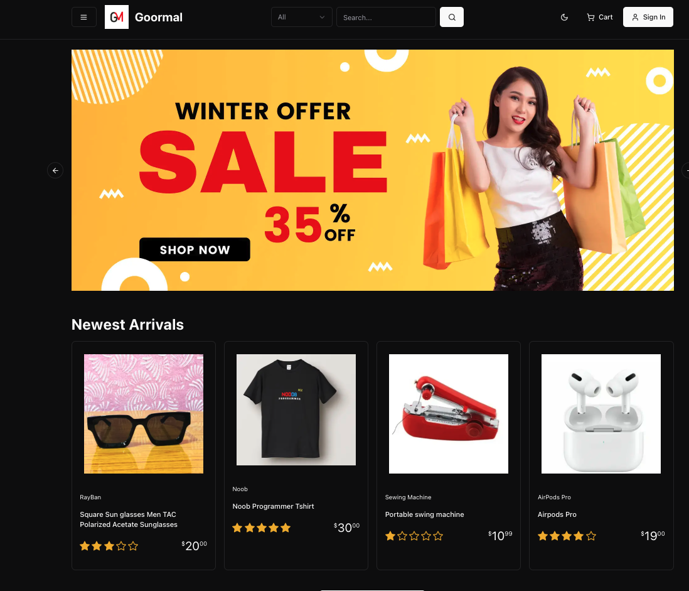

# Goormal

[](https://vercel.com/rezthecoders-projects/goormal)

  

Goormal is a project deployed on Vercel. This repository contains the source code and necessary configurations for the application.

## 🚀 Live Demo
You can access the live version here:
[Goormal on Vercel](https://vercel.com/rezthecoders-projects/goormal)

## 📦 Installation
To set up the project locally, follow these steps:

1. **Clone the repository:**
   ```sh
   git clone https://github.com/your-username/goormal.git
   ```
2. **Navigate to the project directory:**
   ```sh
   cd goormal
   ```
3. **Install dependencies:**
   ```sh
   npm install
   ```
4. **Run the development server:**
   ```sh
   npm run dev
   ```

## 🛠️ Technologies Used
- **Next.js** – Framework for React applications
- **Vercel** – Hosting and deployment
- **Tailwind CSS** – Styling framework (if applicable)
- **Node.js** – Backend runtime environment
- **Express.js** – Backend framework (if applicable)
- **MongoDB / Firebase** – Database (if used)

## 📄 Environment Variables
Ensure you configure any necessary environment variables in a `.env.local` file:
```sh
NEXT_PUBLIC_API_KEY=your_api_key_here
DATABASE_URL=your_database_url_here
SECRET_KEY=your_secret_key_here
```

## 🚀 Deployment
To deploy the project on **Vercel**, follow these steps:
1. Install Vercel CLI:
   ```sh
   npm install -g vercel
   ```
2. Login to Vercel:
   ```sh
   vercel login
   ```
3. Deploy:
   ```sh
   vercel
   ```

## 🧩 Features
- ✅ User Authentication
- ✅ Dynamic Content Rendering
- ✅ Responsive UI Design
- ✅ Fast and Scalable Hosting with Vercel
- ✅ API Integration (if applicable)

## 📝 Usage
After setting up the project, you can start using it by:
- Registering/Login to access features.
- Navigating through different sections.
- Using provided APIs to fetch/update data.

## 🐞 Troubleshooting
If you encounter issues, try the following:
- Ensure dependencies are installed: `npm install`
- Restart the server: `npm run dev`
- Check environment variables in `.env.local`
- Look at console logs for debugging

## 📜 License
This project is licensed under the **MIT License**.

## 🤝 Contributing
Pull requests are welcome! Feel free to open an issue or contribute to the project.

## 📞 Contact
For any questions, reach out at **your-email@example.com** or connect on GitHub at [Rezthecoder](https://github.com/Rezthecoder).

